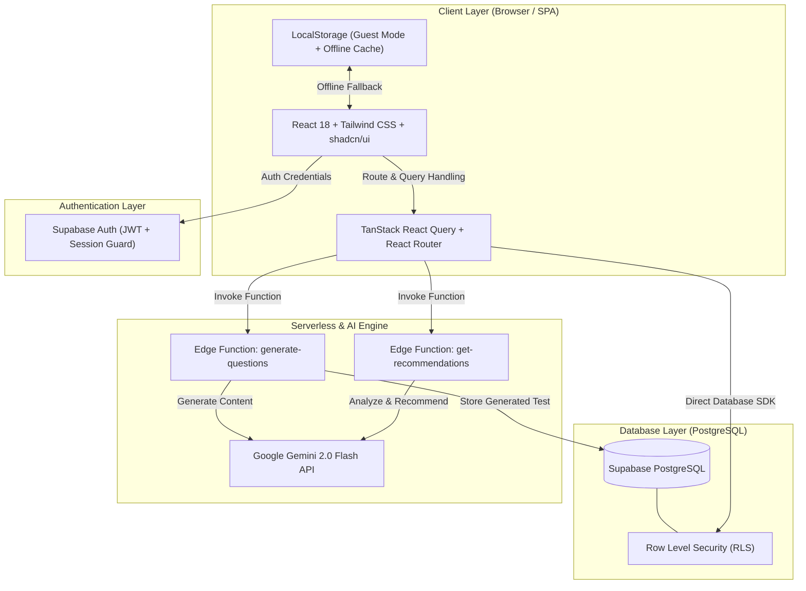
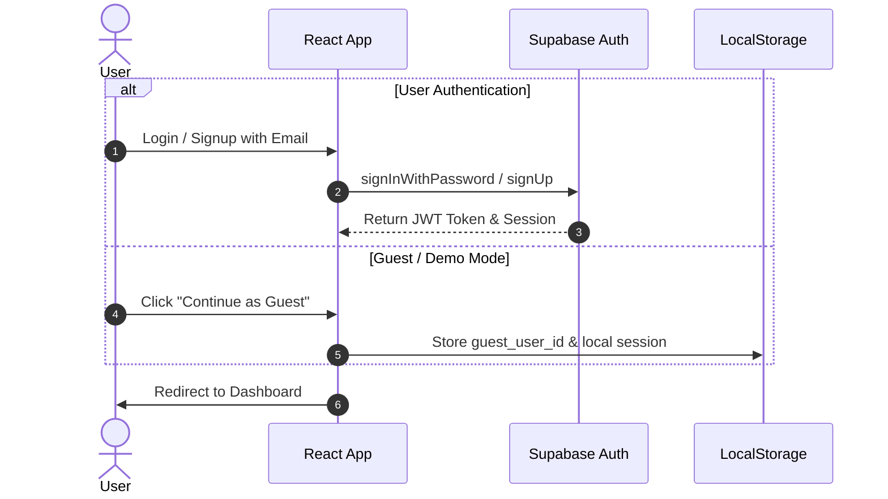
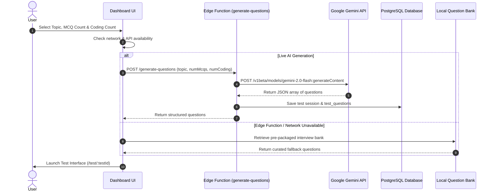
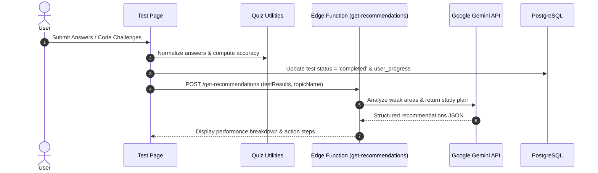
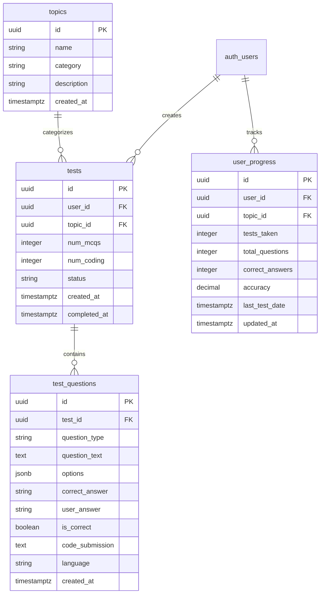

# SmartQuiz Buddy — System Architecture & Workflow Specification

This document provides a comprehensive technical overview of the **SmartQuiz Buddy** platform architecture, data flows, database schemas, security mechanisms, and serverless Edge Function workflows.

---

## 🏛️ High-Level System Architecture

SmartQuiz Buddy is engineered as a modern, serverless single-page web application (SPA) backed by **Supabase** and powered by **Google Gemini 2.0 Flash AI**.

---

## 🔄 End-to-End User & Data Workflow

### 1. Authentication & Session Initialization

### 2. Mock Test Generation Workflow

### 3. Test Evaluation & AI Study Recommendations

---

## 🗄️ Database Schema & RLS Security

### Data Schema Overview

### Security Architecture — Row Level Security (RLS)

Every database table is strictly protected by PostgreSQL RLS policies:
- **`topics`**: Publicly readable by all users (`USING (true)`).
- **`tests`**: Strictly scoped to `auth.uid() = user_id`.
- **`test_questions`**: Scoped via subquery to tests owned by `auth.uid()`.
- **`user_progress`**: Scoped to `auth.uid() = user_id`.

---

## 💻 Tech Stack Summary

| Component | Technology | Role |
|-----------|------------|------|
| **UI Framework** | React 18 (TypeScript) | Declarative component UI |
| **Bundler** | Vite 5 + SWC | Lightning fast dev server & optimized production build |
| **Styling** | Tailwind CSS 3.4 + shadcn/ui | Utility-first responsive design system |
| **State & Fetching** | TanStack React Query v5 | Server state caching and synchronization |
| **Routing** | React Router v6 | Client-side page navigation |
| **Backend & Auth** | Supabase (PostgreSQL + Auth) | Cloud database and user session management |
| **Serverless AI** | Supabase Edge Functions + Deno | Edge execution of Gemini API requests |
| **AI Model** | Google Gemini 2.0 Flash | Dynamic CS question & recommendation generation |

---

## 🛡️ Reliability & Fault Tolerance

1. **Graceful Fallback**: If the Gemini API or network connection is unavailable, the application seamlessly switches to a comprehensive pre-built question bank for all 8 CS subjects.
2. **Session Preservation**: Test progress and guest accounts are stored in `localStorage` to prevent data loss on page refresh.
3. **Defensive Component Rendering**: Loading skeletons and error boundaries prevent white-screen crashes under missing or partial data states.
