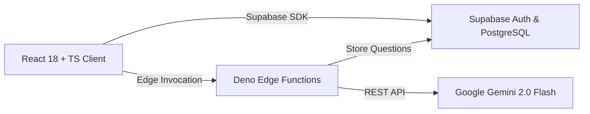

# SmartQuiz Buddy — AI-Powered CS Mock Test & Interview Prep


**SmartQuiz Buddy** is an intelligent, full-stack computer science assessment platform designed to help software engineers prepare for technical interviews. Powered by **Google Gemini 2.0 Flash AI** via **Supabase Edge Functions**, it generates dynamic mock tests, evaluates multiple-choice and coding submissions, and delivers personalized study roadmaps.

---

## 🌟 Key Features

- **⚡ AI-Generated Assessments**: Unique MCQs and coding challenges dynamically synthesized by Google Gemini 2.0 Flash.
- **📚 8 Core CS Domains**:
  - Data Structures & Algorithms
  - Object-Oriented Programming (OOP)
  - Database Management Systems (DBMS)
  - Operating Systems
  - Computer Networks
  - Web Development
  - System Design
- **💻 Integrated Code Editor**: Multi-language code editor supporting Python, JavaScript, TypeScript, Java, C++, C, Go, and Rust with starter templates and Tab indentation.
- **🌓 Dynamic Light & Dark Mode**: Modern, accessible design system supporting instant theme switching.
- **📊 Interactive Analytics**: Retention tracking, mastery percentage curves, and score breakdown charts powered by Recharts.
- **🛡️ Robust Offline Fallback**: Built-in curated interview question bank ensures uninterrupted user testing even without internet or API key configuration.
- **👤 Guest / Demo Session**: Instant, zero-friction access to all features without mandating email authentication.

---

## 🏗️ Architecture Overview



> 📖 **Deep Dive**: For full sequence diagrams, database ER diagrams, RLS security policies, and technical specifications, refer to [**ARCHITECTURE.md**](./ARCHITECTURE.md).

---

## 🛠️ Tech Stack

| Domain | Technology | Purpose |
|--------|------------|---------|
| **Frontend UI** | React 18, TypeScript 5.8 | Component-driven single page application |
| **Build & Tooling** | Vite 5 (SWC) | Fast dev server, HMR, and optimized bundler |
| **Styling System** | Tailwind CSS 3.4, shadcn/ui (Radix) | Responsive UI components & accessible design tokens |
| **Server State** | TanStack React Query v5 | Server state caching, optimistic updates, background sync |
| **Client Routing** | React Router v6 | Declarative client-side page routing |
| **Backend & Auth** | Supabase (PostgreSQL + Auth) | Relational database, user authentication & RLS policies |
| **Serverless Engine** | Supabase Edge Functions (Deno) | Edge API handlers connecting client to Gemini AI |
| **AI Model** | Google Gemini 2.0 Flash | Content generation for questions & study advice |
| **Charts & Data Visualization** | Recharts | SVG-based score and accuracy visualization |

---

## 🚀 Getting Started

### Prerequisites

- **Node.js** (v18.0 or higher)
- **npm** (comes with Node.js)
- A free **[Supabase Account](https://supabase.com)**
- A free **[Google Gemini API Key](https://aistudio.google.com/apikey)**

### Installation

```bash
# 1. Clone the repository
git clone https://github.com/yashdixit568-sys/smart-quiz-buddy.git
cd smart-quiz-buddy

# 2. Install dependencies
npm install

# 3. Start local development server
npm run dev
```

The application will launch at `http://localhost:8080`.

---

## ⚙️ Environment & API Setup

### 1. Frontend Environment Variables (`.env`)

Create a `.env` file in the project root:

```env
VITE_SUPABASE_URL=https://your-supabase-project.supabase.co
VITE_SUPABASE_ANON_KEY=your-supabase-anon-key
```

### 2. Supabase Edge Functions Secret Setup

To enable live AI question generation, configure your Gemini API Key in your Supabase Dashboard:

1. Navigate to **Supabase Dashboard → Edge Functions → Secrets**.
2. Add a new secret:
   - **Name**: `GEMINI_API_KEY`
   - **Value**: *Your Google Gemini API Key* (`AIzaSy...`)

---

## 📁 Repository Structure

```
smart-quiz-buddy/
├── .github/
│   └── workflows/
│       └── ci.yml             # GitHub Actions CI build & lint workflow
├── public/
│   └── favicon.svg            # Custom Brain SVG favicon
├── src/
│   ├── components/            # Reusable UI components
│   │   ├── ui/                # shadcn/ui primitives
│   │   ├── Navbar.tsx         # Responsive navbar with theme toggle
│   │   ├── TopicSelector.tsx   # Subject selection & customization
│   │   ├── MCQQuestion.tsx    # Multiple choice question component
│   │   ├── CodingQuestion.tsx # Multi-language code editor
│   │   └── ProgressOverview.tsx # Subject mastery analytics
│   ├── pages/                 # Route views
│   │   ├── Auth.tsx            # Login, Signup, Guest bypass
│   │   ├── Dashboard.tsx       # Main dashboard
│   │   ├── Test.tsx            # Active test session
│   │   ├── Results.tsx         # Score review & AI study plan
│   │   └── NotFound.tsx        # 404 handler
│   ├── lib/                   # Utilities & offline fallback bank
│   │   ├── quizUtils.ts       # Scoring & guest storage helpers
│   │   └── fallbackQuestions.ts # Curated offline question bank
│   └── integrations/
│       └── supabase/          # Supabase client & DB types
├── supabase/
│   ├── functions/             # Deno serverless edge functions
│   │   ├── generate-questions/ # AI question generation
│   │   └── get-recommendations/# AI recommendation engine
│   └── migrations/            # PostgreSQL migrations & RLS policies
├── ARCHITECTURE.md            # Detailed system design & sequence diagrams
├── README.md                  # Project documentation
└── vite.config.ts             # Vite configuration
```

---

## 🧪 Development Scripts

| Command | Description |
|---------|-------------|
| `npm run dev` | Start development server on port 8080 |
| `npm run build` | Compile TypeScript & build production bundle in `dist/` |
| `npm run preview` | Preview production build locally |
| `npm run lint` | Execute ESLint static code analysis |

---

## 📜 License

This project is open-source and available under the [MIT License](LICENSE).
